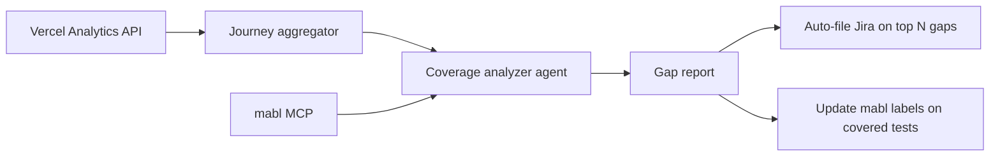

# RUM-driven test-coverage POC

A small, demoable agentic loop that compares **real-user journey data**
against **existing mabl test coverage** and surfaces gaps. The output
is a ranked list of "things real users do that we don't test."

This closes the loop the original architecture audit identified as a
quarterly roadmap item:

> *"Real-user behavior should drive what gets tested, not engineers'
> assumptions."*

## Pieces

| Piece | File | Role |
|---|---|---|
| Mock generator | `scripts/generate-rum-mock.mjs` | **Recommended for demos.** Generates deterministic curated journey data with deliberate coverage gaps — instant, no real-traffic required |
| Loadgen | `scripts/loadgen-rum.mjs` | Drives real Playwright sessions against prod. Useful when you want actual HTTP traffic; usually filtered out by Vercel Analytics bot detection |
| Journey log | `/tmp/loadgen-journeys.json` | Proxy "real user journey" data for the POC. Same format from either source |
| Analyzer | `.claude/agents/rum-coverage-analyzer.md` | Claude Code subagent — reads log + mabl test inventory, outputs gap analysis |
| Wrapper | `scripts/demo-rum-coverage.sh` | One-command: data-gen (mock or live) → analyzer invocation hint |

## Architectural shortcut for the POC

In production, the analyzer would read journeys from the **Vercel
Analytics API**. The POC substitutes a **loadgen-driven journey log**
because:

1. Vercel Analytics API access varies by plan + requires token setup.
2. The loadgen gives us deterministic, repeatable demo data.
3. The agent logic is identical — only the input source changes.

Migration to production is a one-function swap in the analyzer:
replace `Read /tmp/loadgen-journeys.json` with a Vercel API GET call.
The journey-clustering, mabl-mapping, and gap-ranking logic stay
exactly the same.

## Run it

### Demo path (recommended) — mock data, instant

```bash
# 1. Generate curated mock journey data (150 sessions, deliberate gaps)
node scripts/generate-rum-mock.mjs --scenario realistic --seed 42

# 2. Invoke the analyzer in Claude Code
claude
> Use the rum-coverage-analyzer subagent to analyze /tmp/loadgen-journeys.json
> and tell me which top journeys are uncovered.
```

Use `--seed 42` for reproducible demo output. Use `--scenario gap-heavy`
if you want the uncovered journeys to dominate the top of the report
(stronger demo punch).

### Live path — Playwright against prod, ~3 min

```bash
# 1. Drive real Playwright traffic (takes ~3 min for 30 sessions)
node scripts/loadgen-rum.mjs --sessions 30

# 2. Same analyzer invocation
claude
> Use the rum-coverage-analyzer subagent to analyze the latest run.
```

Caveat: Vercel Analytics filters most synthetic browser traffic
including Playwright. The loadgen produces a valid journey log but
the live dashboard rarely populates from it. The mock path is better
for demos that show "this is what real users do."

## What the analyzer outputs

A structured report with:

1. **Top journeys observed** — ranked by session count, with device + locale distribution
2. **Mabl test inventory snapshot** — what tests exist, what URLs they cover
3. **Coverage matrix** — for each top journey, which mabl tests cover it (✅ / ⚠️ / ❌)
4. **Ranked gap list** — uncovered journeys ordered by session frequency
5. **Recommended actions** — Jira tickets to file, tests to deprecate, priorities to bump

## Why this matters

Three reasons this pattern is high-leverage:

1. **It closes a real-world loop.** Today engineers decide what to test based on what the codebase exposes. Tomorrow the test backlog is driven by what users actually do.
2. **It validates existing test value.** A mabl test covering a journey nobody runs is maintenance burden. Now you have data to deprecate it.
3. **It scales with the product.** New feature ships → users start exercising it → new journey appears → gap surfaces → mabl test gets prioritized. Zero manual coverage audits.

## Production migration path



POC pieces to evolve:

| POC | Production |
|---|---|
| `loadgen-rum.mjs` driving traffic | Real users + Vercel Analytics |
| `/tmp/loadgen-journeys.json` static file | Vercel Analytics API call |
| Manual `claude` invocation | Scheduled GHA workflow (weekly cron) |
| Manual Jira filing | Auto-filing via Atlassian MCP |
| One-shot report | Trend tracking — gap count over time |

## Demo narrative

> *"We've been talking about closing the loop on test coverage. Today our mabl tests cover what we **think** users do. With this loop they cover what users **actually** do. Loadgen drives realistic traffic — Vercel Analytics records it — the agent reads it, cross-references with our mabl inventory, and tells us which top journeys are uncovered. We can scale this to a weekly automated audit and an auto-Jira-file for any gap above N sessions. That's not a demo of a test runner — that's a demo of a self-prioritizing test suite."*

## Limitations / known caveats

- **Bot filtering.** Vercel filters known-bot UAs from Analytics by design. The loadgen uses real Chromium + realistic device profiles, so most sessions land in the dashboard. Some IPs may still be filtered — that's expected for synthetic.
- **URL normalization.** The analyzer treats `/products/apex-velocity-pro-stick` and `/products/cyclone-pro-skates` as the same journey path (`/products/[slug]`). Necessary for clustering; could be too aggressive for some use cases.
- **Session count thresholds.** The "gap matters" cutoff is judgment. Current default: top 5 journeys → must have coverage. Tune per workspace.
- **No coverage of API-only journeys.** Vercel Analytics is browser-side; pure-API consumers (mobile app, server-to-server) aren't captured. Mabl's API tests still matter.

## References

- `docs/AGENTIC-SHIFT-LEFT.md` — broader pipeline narrative
- `docs/LOCAL-GATE.md` — synthetic test layers
- `docs/MERGE-POLICY.md` — gate policy this pattern would extend
- `.claude/agents/rum-coverage-analyzer.md` — the agent's system prompt
- `scripts/loadgen-rum.mjs` — the loadgen
